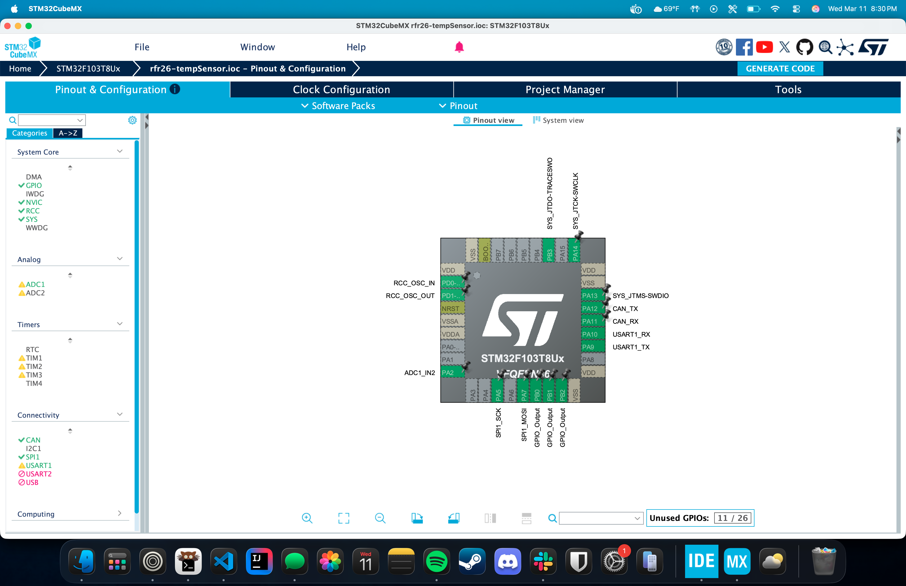
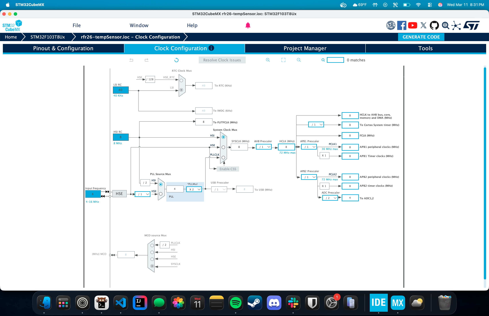
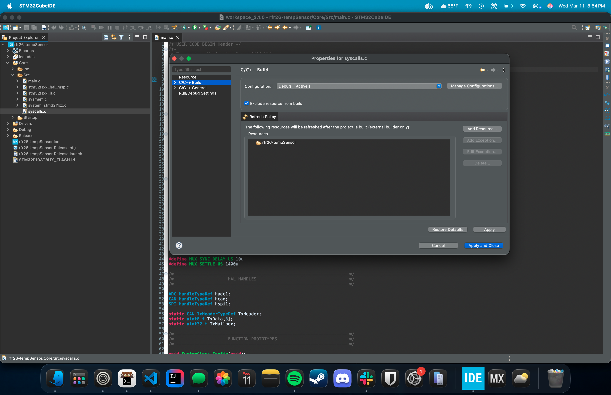
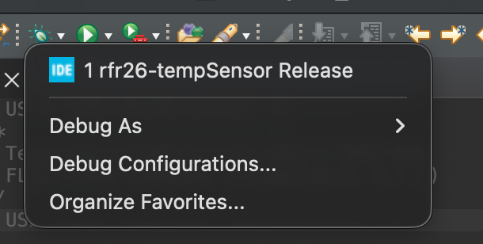
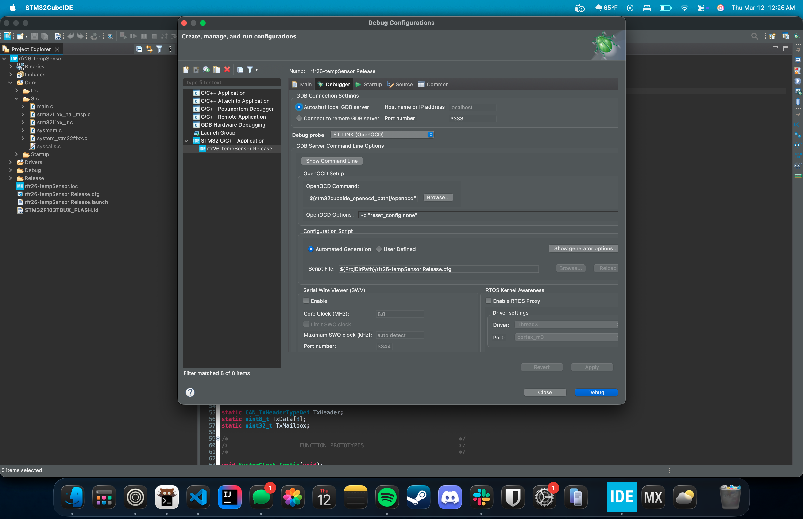
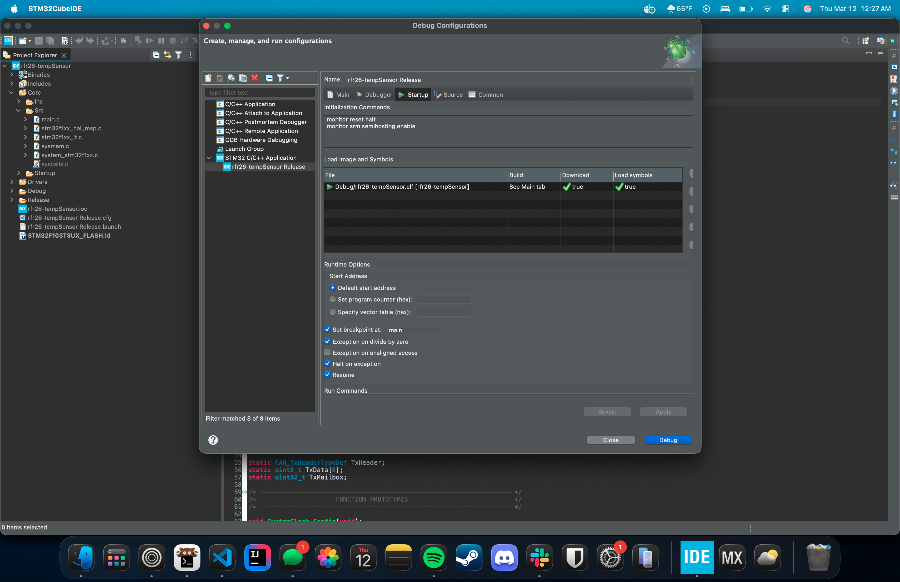
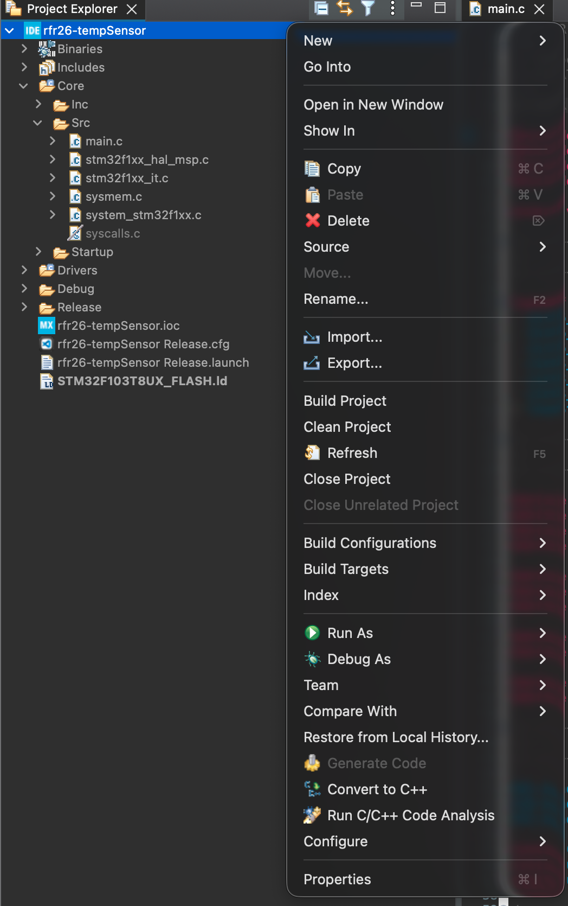
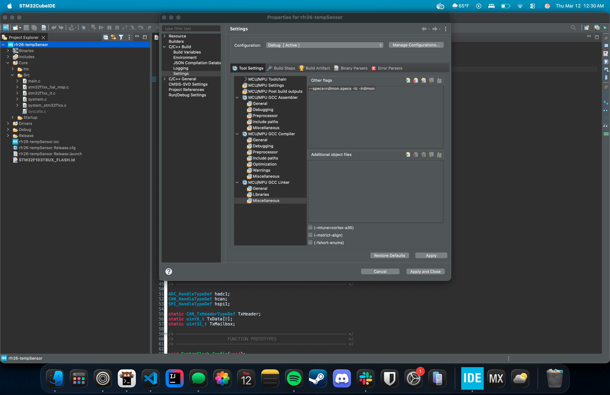
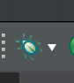

# Setup Guide for STM32

## Initial setup
### 1. Cloning the repository
<details>
  <summary>With git</summary>
    You want to start by cloning this repository locally.You can use the following command: 

    ```sh
    git clone https://github.com/jeevanshah07/Rutgers-Formula-Racing.git
    ```

</details>

<details>
  <summary>Without git</summary>
    If you don't have [git](https://git-scm.com) installed you can go to the top right of this repository and download it as a `.zip` file. Click the green '<> Code' button and then click 'Download ZIP'

</details>

### 2. Downloading software
> [!IMPORTANT]
> **This guide uses STM32CubeIDE v2.1.0 and STM32CubeMX**

Download [STM32CubeMX](https://www.st.com/en/development-tools/stm32cubemx.html#section-get-software-table) and [STM32CubeIDE](https://www.st.com/en/development-tools/stm32cubeide.html) from [www.st.com](www.st.come). You may need to make an account to download them.

## Setting up the project
1. Once you've downloaded the necessary software and have a local copy of the repository on your computer, open up STM32CubeMX and go to **File -> Load Project**. Navigate to wherever your local copy of the repository is on your computer and open up the file `Rutgers-Formula-Racing/rfr26-tempSensor/rfr26-tempSensor.ioc`. This will automatically load the STM with the necessary pin and clock setup. You can check that your STM board looks like this:

and the clock configuration should be:

to finish, hit the bright blue 'Generate Code' button in the top right.
2. After hitting the generate code button it should automatically open the IDE, if not, open it.
3. Once you have the project open in the IDE, open `Core/src/main.c` in the file tree and paste in the content of `Rutgers-Formula-Racing/rfr26-tempSensor/Core/src/main.c` into the IDE. You can go to **Project -> Build Project** to build the project and ensure that it compiles without error.

## Configuring build settings
1. We need to exclude `syscalls.c` from the build. In the file tree in the IDE, right click on `Core/src/syscalls.c` and click the properties option. Go to **C/C++ build** and check the 'Exclude Resource from Build' box. Click 'Apply and Close' to finish.

2. Next, click the small dropdown next to the bug icon and open **Debug Configurations...**

then go to the **Debugger** tab and copy these settings:

In the **Startup** tab you want to add the following commands:
```
monitor reset halt
monitor arm semihosting enable
```

3. Finally, right click on the project in the file explorer and open up properties

then go to **C/C++ Build -> Settings -> MCU/MPU GCC Linker -> Miscellaneous** and add the following into **Other Flags**
```
--specs=rdimon.specs -lc -lrdimon
```

and click apply and close.

## Viewing serial output
Once you are done with configuration, you should click the debug icon



to start a debugging session. Then wait as it flashes and loads. Finally hit the continue button to move past the first breakpoint and you should see everything working. If it doesn't work, then just try it again and pray!
