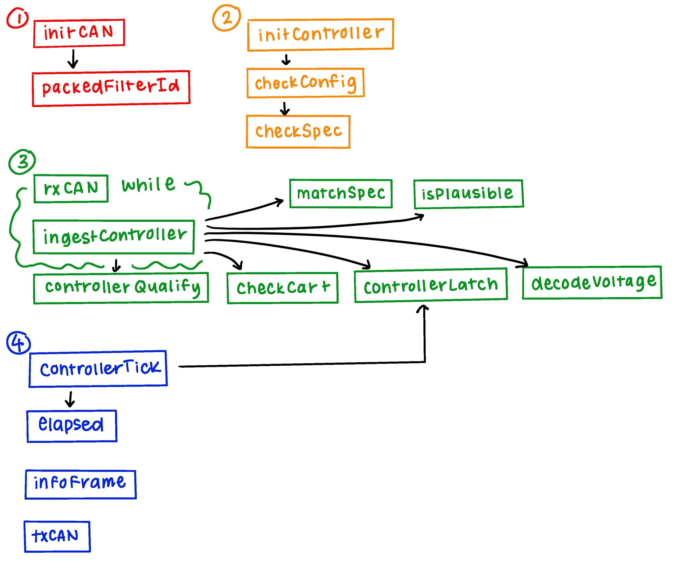

# Precharge Firmware in C

Hardware: [STM32F103T8U6](https://octopart.com/part/stmicroelectronics/STM32F103T8U6)

Enabling `printf()` can be tricky. If you run into issues, this [thread](https://www.reddit.com/r/embedded/comments/1bby3qt/the_definitive_guide_to_enabling_printf_on_an/) may be helpful.

## Compile

Ensure `BASE_CONFIG.ready` is `true` once ready for testing.

You can change the optimization option in the Makefile.

```bash
$ make clean # To clear build files
$ make
```

## Code Structure

As visual aid, the image below shows what functions call each other.

